# Creative Canva - Gesture-Based Digital Art Platform

## 🚀 Overview
**Creative Canvas** is a digital art platform that transforms hand gestures into strokes on a virtual canvas using **computer vision and machine learning**. Designed primarily for children, it makes digital drawing accessible, interactive, and engaging—eliminating the need for traditional drawing tools.

## 🔹 Key Features
- **Real-Time Gesture-Based Drawing** – Converts hand movements into digital strokes.
- **Webcam-Based Hand Tracking** – Uses `MediaPipe` for precise fingertip detection.
- **Custom Shape Recognition** – Sketch and scan images to create personalized shapes.
- **Multi-Color & Brush Options** – Users can choose different brush sizes and colors.
- **Gesture-Based Eraser & Undo** – Allows users to erase or undo gestures intuitively.
- **Intuitive, Child-Friendly UI** – Simple controls for a smooth creative experience.
- **Seamless File Management** – Save and export artwork in PNG, JPEG, or PDF formats.

## 🏷 Tech Stack
- **Frontend UI:** PyQt5 (for web version)
- **Computer Vision:** OpenCV, MediaPipe
- **Backend Processing:** NumPy, Matplotlib
- **Rendering Engine:** Qt Framework
- **Deployment:** Docker (optional for web hosting)

## 👝 Installation & Setup
### 📌 Prerequisites
Ensure you have **Python 3.8+** installed along with dependencies.

### 📦 Install Dependencies
```bash
pip install opencv-python mediapipe numpy PyQt5 matplotlib
```

### ▶ Run the Application
```bash
python main.py
```

## 📺 Project Structure
- `main.py` – Core application file
- `ui/` – UI components built using PyQt5
- `vision/` – Computer vision processing using OpenCV & MediaPipe
- `models/` – Optional ML models for advanced shape recognition
- `assets/` – Icons, images, and UI assets
- `exports/` – User-generated artwork storage

## ⚙ System Workflow
1. **Webcam Input** – Captures real-time video feed.
2. **Gesture Detection** – `MediaPipe Hand Tracking` identifies fingertips.
3. **Drawing Interpretation** – Converts hand movements into brush strokes.
4. **Real-Time Rendering** – Smooth drawing experience using Qt rendering.
5. **User Interactions** – Shape tools, color selection, and eraser functionality.
6. **File Management** – Save, load, and export features for user convenience.

## 🔄 Flowchart
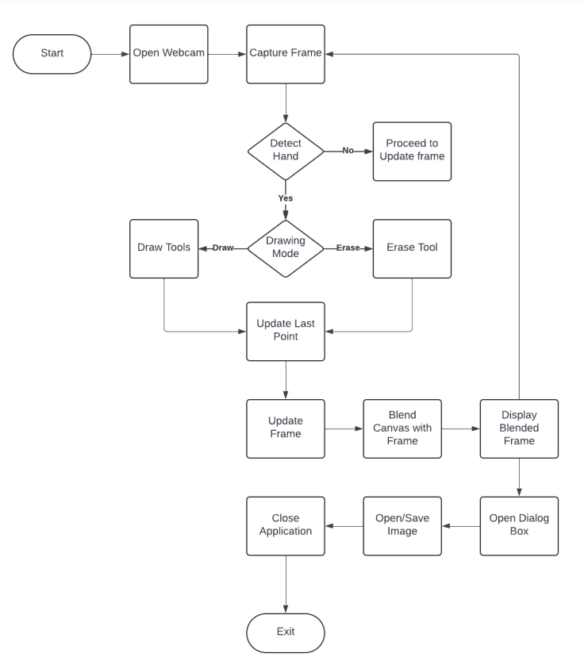

## 📸 Image Gallery
<table>
  <tr>
    <td>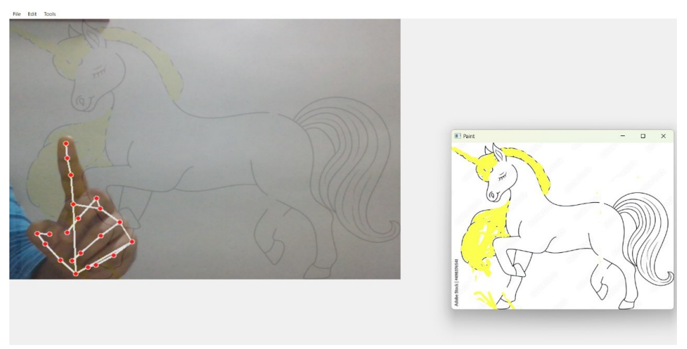<br>🎨 Swipe & Sketch – User Snapshot!</td>
    <td>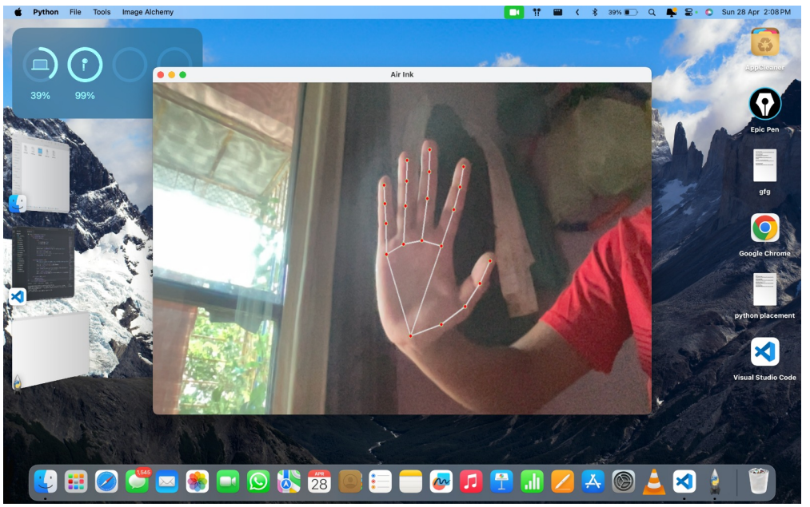<br>🖐 Magic at Your Fingertips – Gesture Detection!</td>
    <td>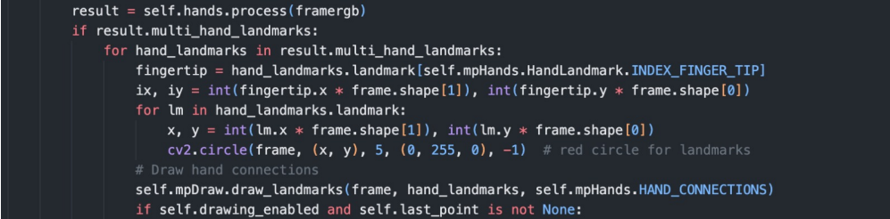<br>💻 - Code Wizardry – Fingertip Detection Code!</td>
  </tr>
  <tr>
    <td>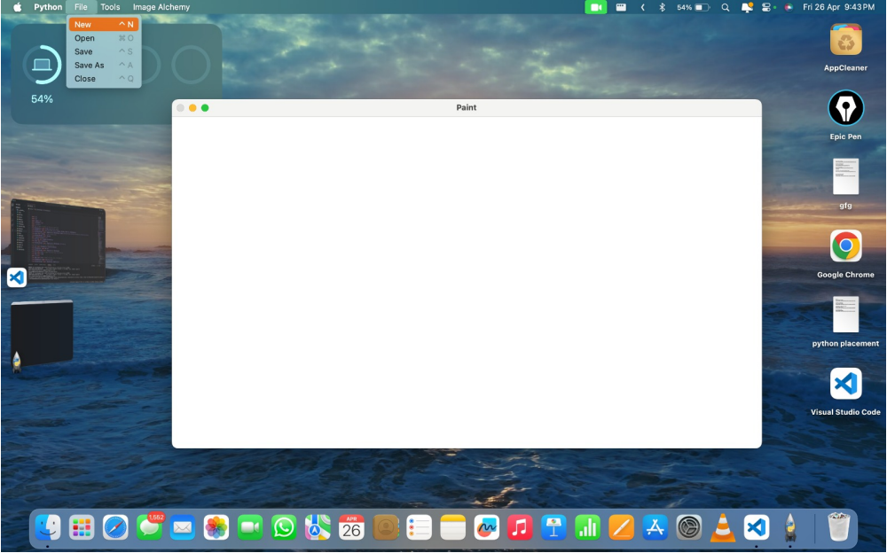<br>📁 Art Vault – Save, Load, & Export!</td>
    <td>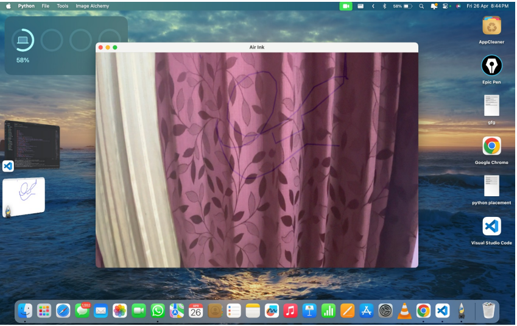<br>👀 See What Users See – User View!</td>
    <td>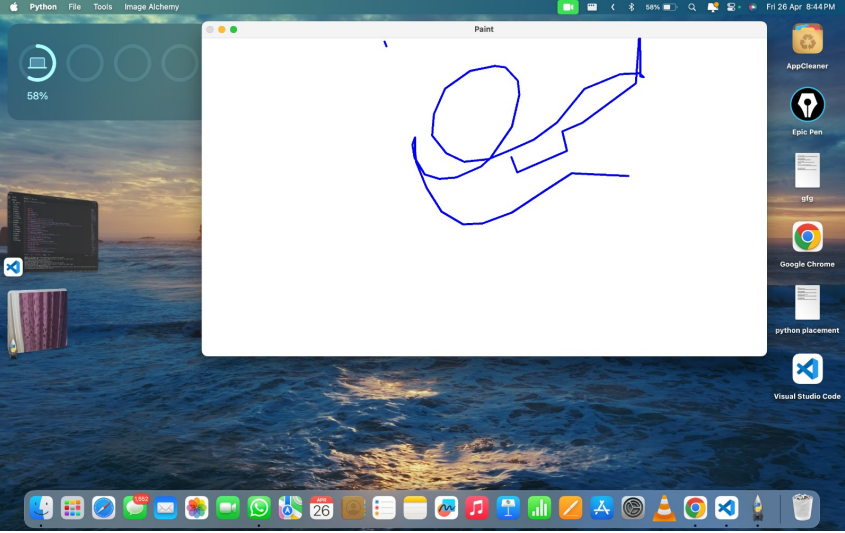<br>🎥 Live Action – Real-Time Drawing!</td>
  </tr>
  <tr>
    <td>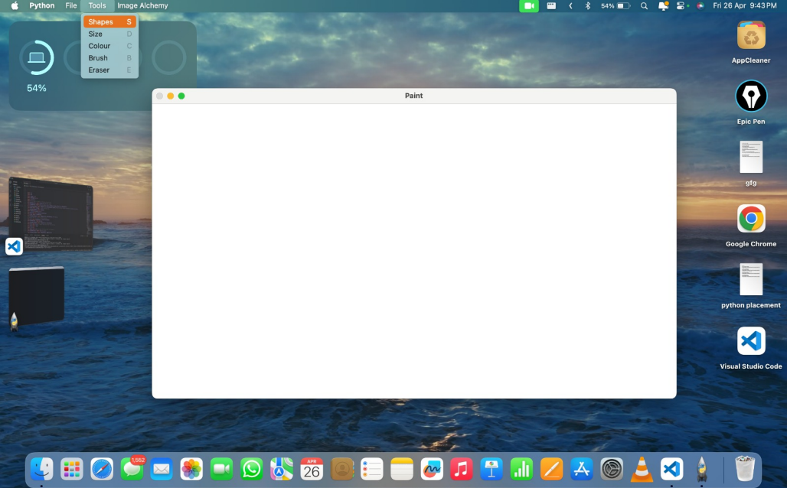<br>🛠 Power Tools – Art Creation Suite!</td>
    <td>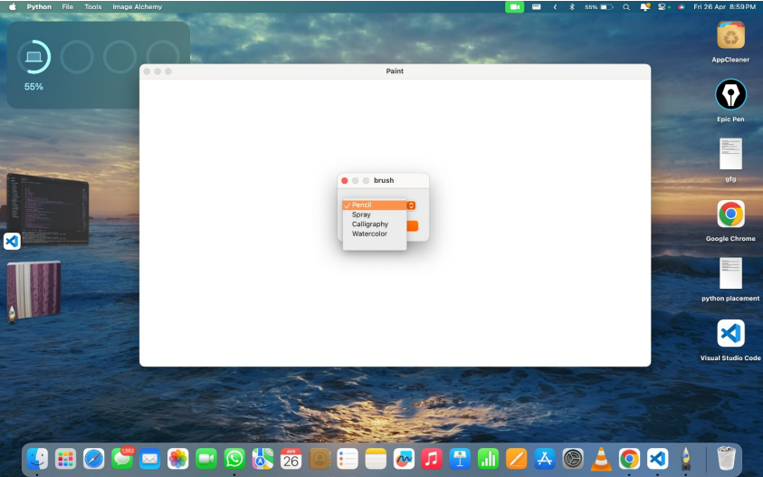<br>🖌️ Brush It Up – Customize Your Strokes!</td>
    <td>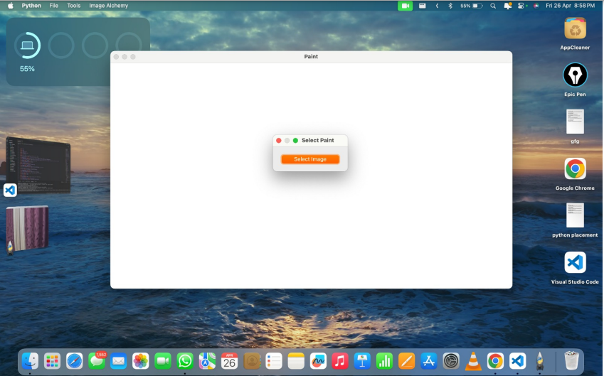<br>🎮 Image Magic – Pick & Transform!</td>
  </tr>
  <tr>
    <td>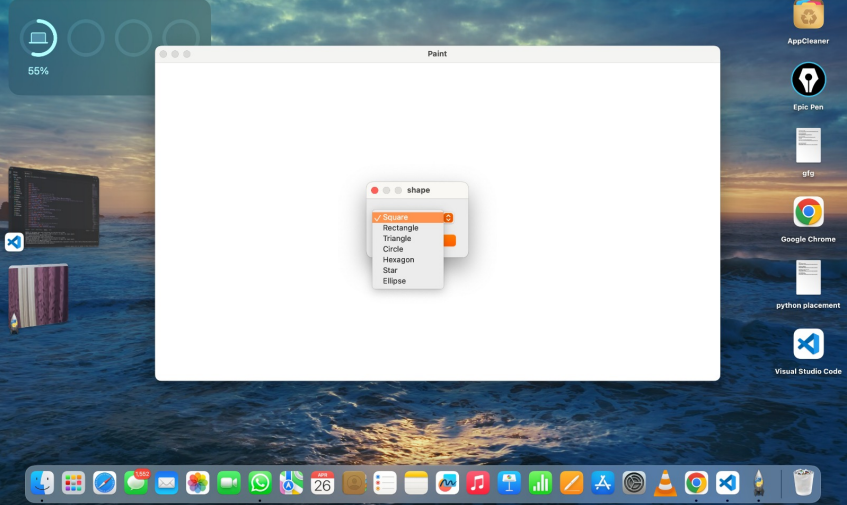<br>🔺 Shapes & Creativity – Choose Your Tools!</td>
    <td><br>📏 Brush Like a Pro – Size Adjustments!</td>
    <td>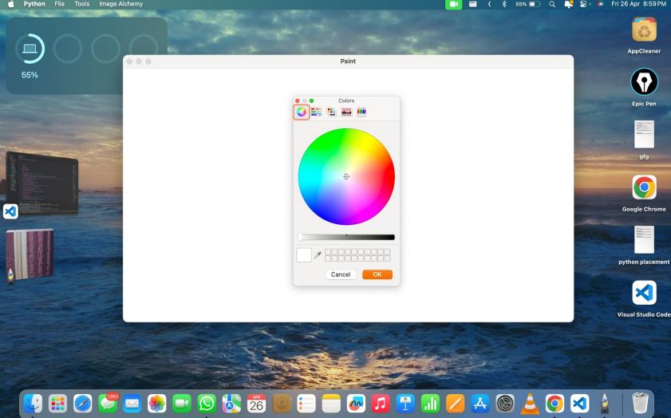<br>🌈 Colors Everywhere – Pick Your Palette!</td>
  </tr>
</table>

## 🎯 Contributions
1. Fork the repo 🍴
2. Clone the project (`git clone https://github.com/your-repo.git`)
3. Create a new branch (`git checkout -b feature-name`)
4. Make your changes and commit (`git commit -m "Added new feature"`)
5. Push the branch (`git push origin feature-name`)
6. Submit a Pull Request ✅

### 🔄 Contribution Workflow
- **Issue Creation** – Report bugs or request features via GitHub Issues.
- **Code Review** – PRs will be reviewed by maintainers before merging.
- **Feature Proposals** – Propose enhancements via discussions.
- **Testing** – Ensure all new features pass unit tests before PR submission.

## 📜 License
This project is licensed under the **MIT License**

## 🔗 Links & References
- **Project Documentation:** [Link](https://drive.google.com/file/d/1u78uDLQGWn2yy-G7qWiXoOR8tZWgU86D/view?usp=drive_link)
- **OpenCV Documentation:** [https://docs.opencv.org/](https://docs.opencv.org/)
- **MediaPipe Hand Tracking:** [https://developers.google.com/mediapipe/solutions/vision/hand_tracking](https://developers.google.com/mediapipe/solutions/vision/hand_tracking)
- **PyQt5 Docs:** [https://www.riverbankcomputing.com/software/pyqt/intro](https://www.riverbankcomputing.com/software/pyqt/intro)
- **NumPy Documentation:** [https://numpy.org/doc/](https://numpy.org/doc/)
- **Matplotlib Docs:** [https://matplotlib.org/stable/contents.html](https://matplotlib.org/stable/contents.html)
- **Docker Guide:** [https://docs.docker.com/](https://docs.docker.com/)

